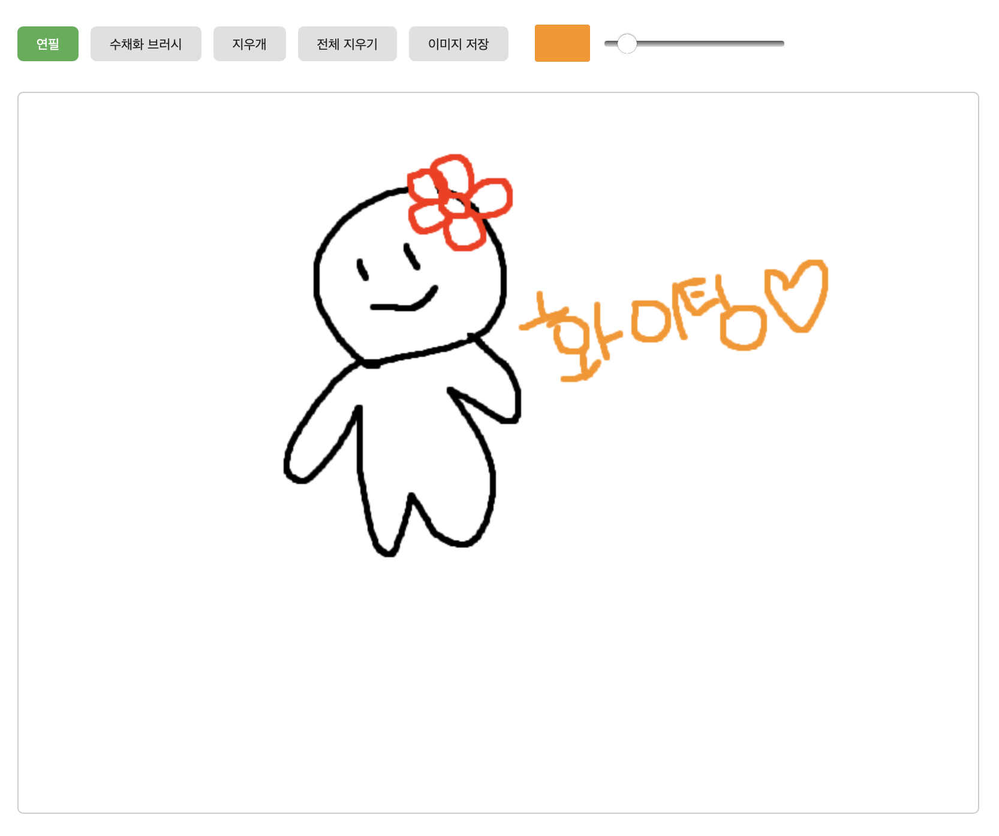

# 🎨 Drawing Web App

HTML5 Canvas와 JavaScript를 활용한 간단한 드로잉 웹앱입니다.  
연필, 수채화 브러시, 지우개 등 다양한 도구로 자유롭게 그림을 그리고,  
완성된 그림은 이미지로 저장할 수 있습니다!

---

## ✨ 주요 기능

- 🖊️ 연필 / 수채화 브러시 / 지우개 도구
- 🎨 색상 선택
- 📏 선 굵기 조절
- 🧼 전체 지우기 버튼
- 💾 이미지 저장 (새 탭에서 저장 안내 제공)
- 📱 모바일 터치 이벤트 지원

---

## 📸 실행 화면

> (아래에 실행 화면 캡처 이미지를 넣어주세요)

```html



## 🛠 사용 방법

# 프로젝트 클론
git clone https://github.com/minhee0830/drawing-web-app.git

# 디렉토리 이동
cd drawing-web-app

# index.html 파일을 브라우저로 열기

## 🧾 폴더구조

drawing-web-app/
├── index.html        # 메인 HTML 파일
├── styles.css        # 스타일 정의
└── script.js         # 그리기 로직 & 이벤트 처리

## 📌 구현 포인트

canvas.getContext('2d')를 활용한 2D 드로잉
mousedown, mousemove, mouseup, touch 이벤트로 마우스/터치 대응
canvas.toDataURL()을 활용한 이미지 저장
스타일은 CSS Flexbox로 레이아웃 구성

## 🙋‍♀️ 만든 사람

GitHub: @minhee0830
Blog: minheestory.tistory.com

